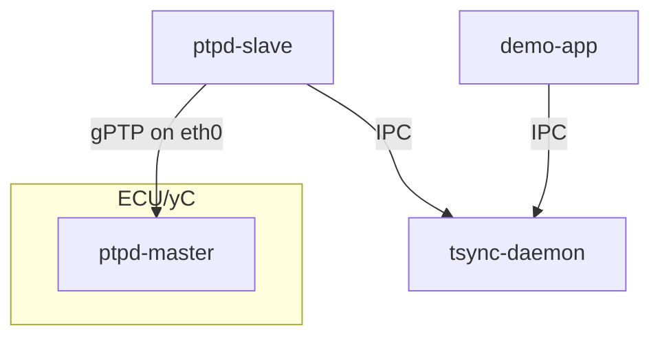

# Demo

Show the PTP-based monotonic clock from application point of view.

## Overview



## Run Demo

Start the tmux session:
```shell
./demo.sh
```

The setup will start 2x PTP instances (one for ECU as master, one for S-Core domain as slave), 1x timesync-daemon (for IPC communication), 1x demo application. All processes will run on the same host, in a normal deployment the time-master would probably be running on a reliable classic ECU.

The demo application will show `Synchronized` status as long as both PTP instances are running. Temporarily stop one of the instances to simulate a `Timeout` status.

Modify system clock (e.g. using `sudo examples/shift_time.sh forward`) to show impact on `OS Elapsed` values and that `PTP Elapsed` values will have no impact.

Navigation:
- Use `Ctrl-b o` to cycle through panes.
- Use `Ctrl-b x` to exit a pane.
- Use `Ctrl-b : kill-session` to exit demo.

## Manual Setup

First, build TSYNC-DAEMON as user and start using sudo:
```
bazel build //src/tsync-daemon:tsync_daemon
export ECUCFG_ENV_VAR_ROOTFOLDER=$(pwd)/bazel-out/k8-fastbuild/bin/src/tsync-daemon/src/
sudo -E bazel-bin/src/tsync-daemon/tsync_daemon
```

Second, start the PTP daemon MASTER

```
bazel build //src/ptpd
sudo bazel-bin/src/ptpd/ptpd -i eth0 -d 1 --global:foreground=Y -M --ptpengine:transport=ethernet --ptpengine:delay_mechanism=DELAY_DISABLED --ptpengine:disable_bmca=y --score:globaltimepropagationdelay=0.0 -L --ptpengine:dot1as=1 --clock:no_adjust=Y -V
```

Start the PTP daemon SLAVE

```
sudo bazel-bin/src/ptpd/ptpd -i eth0 -d 1 --global:foreground=Y -s --ptpengine:transport=ethernet --ptpengine:delay_mechanism=DELAY_DISABLED --ptpengine:disable_bmca=y --score:globaltimepropagationdelay=0.0 -L --ptpengine:dot1as=1 --clock:no_adjust=Y -V
```

Now start the demo application:

```
bazel build //examples:get_current_time
sudo -E bazel-bin/examples/get_current_time
```

While the demo application running, modify the system clock to show a drift/jump in the system clock.
Meanwhile, the PTP reported time will be monotonic:

Expected output
```
OS=1768400322951429085 PTP=58753506346931 OS Elapsed=86019523725 PTP Elapsed=86019521221 Status=Not synchronized
OS=1768400323951576229 PTP=58754506498519 OS Elapsed=87019670869 PTP Elapsed=87019672809 Status=Not synchronized
OS=1768400324951803426 PTP=58755506721754 OS Elapsed=88019898066 PTP Elapsed=88019896044 Status=Synchronized
OS=1768400325952081179 PTP=58756506998626 OS Elapsed=89020175819 PTP Elapsed=89020172916 Status=Synchronized
OS=1768400326952328115 PTP=58757507248144 OS Elapsed=90020422755 PTP Elapsed=90020422434 Status=Synchronized
<-- OS Clock changed by running shift_time.sh -->
OS=1768400027645599910 PTP=58758507514207 OS Elapsed=-209286305450 PTP Elapsed=91020688497 Status=Synchronized
OS=1768400028645856334 PTP=58759507786837 OS Elapsed=-208286049026 PTP Elapsed=92020961127 Status=Synchronized
OS=1768400029646033445 PTP=58760507948626 OS Elapsed=-207285871915 PTP Elapsed=93021122916 Status=Synchronized
<-- OS Clock changed back -->
OS=1768400330953345151 PTP=58761508256548 OS Elapsed=94021439791 PTP Elapsed=94021430838 Status=Synchronized
OS=1768400331953626191 PTP=58762508539221 OS Elapsed=95021720831 PTP Elapsed=95021713511 Status=Synchronized
OS=1768400332953940464 PTP=58763508852192 OS Elapsed=96022035104 PTP Elapsed=96022026482 Status=Synchronized
OS=1768400333954158292 PTP=58764509072216 OS Elapsed=97022252932 PTP Elapsed=97022246506 Status=Synchronized
OS=1768400334954303570 PTP=58765509214788 OS Elapsed=98022398210 PTP Elapsed=98022389078 Status=Synchronized
OS=1768400335954560065 PTP=58766509471068 OS Elapsed=99022654705 PTP Elapsed=99022645358 Status=Synchronized
```

Note that OS Elapsed has jumps whereas PTP Elapsed is continuous.
